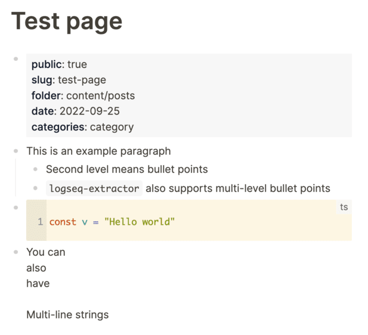

# logseq-extractor

Tool to take raw [Logseq](https://github.com/logseq/logseq) Markdown files with `public::` page properties and turn them into Markdown blog posts with front matter.

- Takes Logseq page properties (`title:: Hello world`) and turns them into [Front Matter properties](https://gohugo.io/content-management/front-matter/) `title: Hello World`.
- Changes the Markdown syntax to remove the top-level bullet points.

## Usage

### Command

```
logseq-extractor
  -blogFolder string
        [MANDATORY] Folder where all public pages are exported.
  -graphPath string
        [MANDATORY] Path to the root of your logseq graph containing /pages and /journals directories.
  -unquotedProperties string
        comma-separated list of logseq page properties that won't be quoted in the markdown frontmatter, e.g. 'date,public,slug'
```

### Logseq page properties with a special meaning (all optional)

- `public` - as soon as this page property is present (regardless of value), the page gets exported
- `slug` used as a file name
- `date` it's used as a file name prefix
- `folder` the page is going to be exported in this subfolder e.g. `content/posts`
  - the `folder` property always uses `/` (forward slash) but on Windows, it gets translated to `\` in folder path
  - if the base export folder is `a` and the `folder` page property is `b/c`, then the resulting page will be in `a/b/c` folder


## From



## To

`content/posts/2022-09-25-test-page.md` :

~~~md
---
date: 2022-09-25
categories: "category"
public: true
slug: test-page
folder: "content/posts"
---

This is an example paragraph

- Second level means bullet points

- `logseq-extractor` also supports multi-level bullet points

```ts
const v = "Hello world"
```

You can
also
have

Multi-line strings
~~~
